# math-as-code

This is a reference to ease developers into mathematical notation by showing comparisons with JavaScript code.

Motivation: Academic papers can be intimidating for self-taught game and graphics programmers. :) 

This guide is not yet finished. If you see errors or want to contribute, please [open a ticket](https://github.com/Jam3/math-as-code/issues) or send a PR.

> **Note**: For brevity, some code examples make use of [npm packages](https://www.npmjs.com/). You can refer to their GitHub repos for implementation details.

# foreword

Mathematical symbols can mean different things depending on context and the field of study (linear algebra, set theory, etc). This guide may not cover *all* uses of a symbol, but PRs are welcome.

For a more complete list, refer to [Wikipedia - List of Mathematical Symbols](https://en.wikipedia.org/wiki/List_of_mathematical_symbols). 

# contents

- [variable name conventions](#variable-name-conventions)
- [equals `=` `≈` `≠` `=:`](#equals-symbols)
- [dot & cross `·` `×`](#dot--cross)
  - [scalar multiplication](#scalar-multiplication)
  - [vector multiplication](#vector-multiplication)
  - [dot product](#dot-product)
  - [cross product](#cross-product)
- [sigma `Σ`](#sigma) - *summation*
- [capital Pi `Π`](#capital-pi) - *products of sequences*
- [pipes `||`](#pipes)
  - [absolute](#absolute)
  - [Euclidean norm](#euclidean-norm)
  - [determinant](#determinant)
- [hat **`â`**](#hat) - *unit vector*
- ["element of" `∈` `∉`](#element)
- [more...](#more)

## variable naming conventions

There are a variety of naming conventions depending on the context and field of study, and they are not always consistent. However, in some of the literature you may find variable names to follow a pattern like so:

- *s* - italic lowercase letters for scalars (i.e. a number)
- **x** - bold lowercase letters for vectors (i.e. a 2D point)
- **A** - bold uppercase letters for matrices (i.e. a 3D transformation)
- *θ* - italic lowercase Greek letters for constants and special variables (i.e. [polar angle *θ*, *theta*](https://en.wikipedia.org/wiki/Spherical_coordinate_system))

This will also be the format of this guide.

## equals symbols

There are a number of symbols resembling the equals sign `=`. Here is a few common ones and an example of their use:

- `=` is for equality (values are the same)
- `≠` is for inequality (value are not the same)
- `≈` is for approximately equal to (`π ≈ 3.14159`)

In JavaScript:

```js
// equality
2 === 3

// inequality
2 !== 3

// approximately equal
almostEqual(Math.PI, 3.14159, 1e-5)

function almostEqual(a, b, epsilon) {
  return Math.abs(a - b) <= epsilon
}
```

In mathematics, the `:=` `=:` and `=` symbols are used for *definition*. The following defines *x* to be another name for 2*kj*.

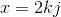

<!-- x = 2kj -->

Code:

```js
var x = 2 * k * j
var k = x / (2 * j)
var j = x / (2 * k)
```

<!--

///// Need a code sample?
///// Maybe better suited in another place?

The `≅` symbol is for [*congruence*](https://en.wikipedia.org/wiki/Congruence_%28geometry%29). For example, here the line segment AB is congruent with the segment CD.

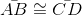

 \bar{AB} \cong \bar{CD} -->

## dot & cross

The dot `·` and cross `×` symbols have different uses depending on context.

They might seem obvious, but it's important to understand the subtle differences before we continue into other sections.

#### scalar multiplication

Both symbols can represent simple multiplication of scalars. The following are equivalent:

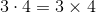

In code we tend to use asterisk:

```js
var result = 3 * 4
```

With adjacent letter variables, the multiplication sign is typically omitted.

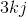

If these variables represent scalars, the code would be:

```js
var result = 3 * k * j
```

#### vector multiplication

To denote multiplication of one vector by another, or multiplication of a vector with a scalar, we do not use the dot `·` or cross `×` symbols. These have different meanings in linear algebra, discussed shortly.

Let's take our earlier example but apply it to vectors:

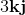

<!-- 3\mathbf{k} \mathbf{j} -->

Here is how it would look in code, using arrays `[x, y]` to represent the 2D vectors.

```js
var s = 3
var k = [ 1, 2 ]
var j = [ 2, 3 ]

var tmp = multiply(k, j)
var result = multiplyScalar(tmp, s)
//=> [ 6, 18 ]
```

Our `multiply` and `multiplyScalar` functions look like this:

```js
function multiply(a, b) {
  return [ a[0] * b[0], a[1] * b[1] ]
}

function multiplyScalar(a, scalar) {
  return [ a[0] * scalar, a[1] * scalar ]
}
```

Similarly, matrix multiplication typically does not use a dot or cross symbol. Matrix multiplication will be covered in a later section.

#### dot product

The dot symbol `·` can be used to denote the [*dot product*](https://en.wikipedia.org/wiki/Dot_product) of two vectors. Sometimes this is called the *scalar product* since it evaluates to a scalar.

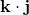

<!-- \mathbf{k}\cdot \mathbf{j} -->

It is a very common feature of linear algebra, and with a 3D vector it might look like this:

```js
var k = [ 0, 1, 0 ]
var j = [ 1, 0, 0 ]

var d = dot(k, j)
//=> 0
```

The result `0` tells us our vectors are perpendicular. Our `dot` function:

```js
function dot(a, b) {
    return a[0] * b[0] + a[1] * b[1] + a[2] * b[2]
}
```

#### cross product

The cross symbol `×` can be used to denote the [*cross product*](https://en.wikipedia.org/wiki/Cross_product) of two vectors.

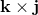

<!-- \mathbf{k}\times \mathbf{j} -->

In code, it would look like this:

```js
var k = [ 0, 1, 0 ]
var j = [ 1, 0, 0 ]

var result = cross(k, j)
//=> [ 0, 0, -1 ]
```

Here, we get `[ 0, 0, -1 ]`, which is perpendicular to both **k** and **j**.

Our `cross` function:

```js
function cross(a, b) {
    var ax = a[0], ay = a[1], az = a[2],
        bx = b[0], by = b[1], bz = b[2]

    var rx = ay * bz - az * by
    var ry = az * bx - ax * bz
    var rz = ax * by - ay * bx
    return [ rx, ry, rz ]
}
```

For other implementations of vector multiplication, cross product, and dot product:

- [gl-vec3](https://github.com/stackgl/gl-vec3)
- [gl-vec2](https://github.com/stackgl/gl-vec2)
- [vectors](https://github.com/hughsk/vectors) - includes n-dimensional

## sigma 

The big Greek "E" (Sigma) is for [Summation](https://en.wikipedia.org/wiki/Summation). In other words: summing up some numbers.

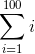

Here, `i=1` says to start at `1` and end at the number above the Sigma, `100`. These are the lower and upper bounds, respectively. The *i* to the right of the "E" tells us what we are summing. In code:

```js
var n = 100
var sum = 0
for (var i = 1; i <= n; i++) {
  sum += i
}
```

The result of `sum` is `5050`.

**Tip:** With whole numbers, this particular pattern can be optimized to the following:

```js
var n = 100
var sum = (n * (n + 1)) / 2
```

Here is another example where the *i*, or the "what to sum," is different:


In code:

```js
var n = 100
var sum = 0
for (var i = 1; i <= n; i++) {
  sum += (2 * i + 1)
}
```

The result of `sum` is `10200`.

The notation can be nested, which is much like nesting a `for` loop. You should evaluate the right-most sigma first, unless the author has enclosed them in parentheses to alter the order. 

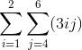

In code:

```js
var sum = 0
for (var i = 1; i <= 2; i++) {
  for (var j = 4; j <= 6; j++) {
    sum += (3 * i * j)
  }
}
```

Here, `sum` will be `135`.

## capital Pi

The capital Pi or "Big Pi" is very similar to [Sigma](#sigma), except we are using multiplication to find the "products of sequences." 

Take the following:

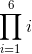

In code, it might look like this:

```js
var n = 6
var value = 1
for (var i = 1; i <= n; i++) {
  value *= i
}
```

Where `value` will evaluate to `720`.

## pipes

Pipe symbols, known as *bars*, can mean different things depending on the context. Below are three common uses: [absolute](#absolute), [Euclidean norm](#euclidean-norm), and [determinant](#determinant).

#### absolute 

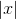

For a number *x*, `| x |` means the absolute of *x*. In code:

```js
var x = -5
var result = Math.abs(x)
// => 5
```

#### Euclidean norm

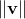

<!-- \left \| \mathbf{v} \right \| -->

For a vector **v**, `‖v‖` is the [Euclidean norm](https://en.wikipedia.org/wiki/Norm_%28mathematics%29#Euclidean_norm) of **v**. It is also referred to as the "magnitude" or "length" of a vector.

Often this is represented by double-bars to avoid ambiguity with the *absolute* notation, but sometimes you may see it with single bars:

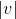

<!-- \left | \mathbf{v} \right | -->

Here is an example using an array `[x, y, z]` to represent a 3D vector.

```js
var v = [ 0, 4, -3 ]
length(v)
//=> 5
```

The `length` function:

```js
function length (vec) {
  var x = vec[0]
  var y = vec[1]
  var z = vec[2]
  return Math.sqrt(x*x + y*y + z*z)
}
```

Other implementations:

- [magnitude](https://github.com/mattdesl/magnitude/blob/864ff5a7eb763d34bf154ac5f5332d7601192b70/index.js) - n-dimensional
- [gl-vec2/length](https://github.com/stackgl/gl-vec2/blob/21f460a371540258521fd2f720d80f14e87bd400/length.js) - 2D vector
- [gl-vec3/length](https://github.com/stackgl/gl-vec3/blob/507480fa57ba7c5fb70679cf531175a52c48cf53/length.js) - 3D vector

#### determinant

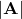

<!-- \left |\mathbf{A}  \right | -->

For a matrix **A**, `|A|` means the [determinant](https://en.wikipedia.org/wiki/Determinant) of matrix **A**.

Here is an example computing the determinant of a 2x2 matrix, represented by a flat array in column-major format.

```js
var determinant = require('gl-mat4/determinant')

var matrix = [ 1, 0, 0, 1 ]
var det = determinant(matrix)
//=> 1
```

Implementations:

- [gl-mat4/determinant](https://github.com/stackgl/gl-mat4/blob/c2e2de728fe7eba592f74cd02266100cc21ec89a/determinant.js) - also see [gl-mat3](https://github.com/stackgl/gl-mat3) and [gl-mat2](https://github.com/stackgl/gl-mat2)
- [ndarray-determinant](https://www.npmjs.com/package/ndarray-determinant)
- [glsl-determinant](https://www.npmjs.com/package/glsl-determinant)
- [robust-determinant](https://www.npmjs.com/package/robust-determinant)
- [robust-determinant-2](https://www.npmjs.com/package/robust-determinant-2) and [robust-determinant-3](https://www.npmjs.com/package/robust-determinant-3), specifically for 2x2 and 3x3 matrices, respectively

## hat

In geometry, the "hat" symbol above a character is used to represent a [unit vector](https://en.wikipedia.org/wiki/Unit_vector). For example, here is the unit vector of **a**:

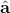

<!-- \hat{\mathbf{a}} -->

In cartesian space, a unit vector is typically length 1, in the range of -1.0 to 1.0. Here we *normalize* a 3D vector into a unit vector:

```js
var a = [ 0, 4, -3 ]
normalize(a)
//=> [ 0, 0.8, -0.6000000000000001 ]
```

Notice, since we are working with floating point values and not using numerically robust operations, we do not get a perfect `-(3/5)` value for the Z component.

Here is the `normalize` function, operating on 3D vectors:

```js
function normalize(vec) {
  var x = vec[0]
  var y = vec[1]
  var z = vec[2]
  var squaredLength = x*x + y*y + z*z

  if (squaredLength > 0) {
    squaredLength = 1 / Math.sqrt(squaredLength)
    vec[0] = vec[0] * squaredLength
    vec[1] = vec[1] * squaredLength
    vec[2] = vec[2] * squaredLength
  }
  return vec
}
```

Other implementations:

- [gl-vec3/normalize](https://github.com/stackgl/gl-vec3/blob/507480fa57ba7c5fb70679cf531175a52c48cf53/normalize.js) and [gl-vec2/normalize](https://github.com/stackgl/gl-vec2/blob/21f460a371540258521fd2f720d80f14e87bd400/normalize.js)
- [vectors/normalize-nd](https://github.com/hughsk/vectors/blob/master/normalize-nd.js) (n-dimensional)

## element

In set theory, the "element of" symbol `∈` and `∋` can be used to describe whether something is an element of a set. For example:

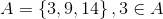

<!-- A=\left \{3,9,14}{  \right \}, 3 \in A -->

Here we have a set of numbers *A* `[ 3, 9, 14 ]` and we are saying `3` is an "element of" that set. In code:

```js
var A = [ 3, 9, 14 ]

A.indexOf(3) >= 0
//=> true
```

The backwards `∋` is the same, but the order changes:

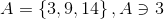

<!-- A=\left \{3,9,14}{  \right \}, A \ni 3 -->

You can also use the "not an element of" symbols `∉` and `∌` like so:

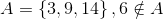

<!-- A=\left \{3,9,14}{  \right \}, 6 \notin A -->

## more...

Like this guide? Suggest some [more features](https://github.com/Jam3/math-as-code/issues/1) or send us a Pull Request!

## License

MIT, see [LICENSE.md](http://github.com/Jam3/math-as-code/blob/master/LICENSE.md) for details.
