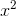
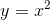
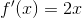

# math-as-code

This is a reference to ease developers into mathematical notation by showing comparisons with JavaScript code.

Motivation: Academic papers can be intimidating for self-taught game and graphics programmers. :) 

This guide is not yet finished. If you see errors or want to contribute, please [open a ticket](https://github.com/Jam3/math-as-code/issues) or send a PR.

> **Note**: For brevity, some code examples make use of [npm packages](https://www.npmjs.com/). You can refer to their GitHub repos for implementation details.

# foreword

Mathematical symbols can mean different things depending on the author, context and the field of study (linear algebra, set theory, etc). This guide may not cover *all* uses of a symbol. In some cases, real-world references (blog posts, publications, etc) will be cited to demonstrate how a symbol might appear in the wild.

For a more complete list, refer to [Wikipedia - List of Mathematical Symbols](https://en.wikipedia.org/wiki/List_of_mathematical_symbols). 

For simplicity, many of the code examples here operate on floating point values and are not numerically robust. For more details on why this may be a problem, see [Robust Arithmetic Notes](https://github.com/mikolalysenko/robust-arithmetic-notes) by Mikola Lysenko.

# contents

- [variable name conventions](#variable-name-conventions)
- [equals `=` `≈` `≠` `:=`](#equals-symbols)
- [dot & cross `·` `×` `∘`](#dot--cross)
  - [scalar multiplication](#scalar-multiplication)
  - [vector multiplication](#vector-multiplication)
  - [dot product](#dot-product)
  - [cross product](#cross-product)
- [sigma `Σ`](#sigma) - *summation*
- [capital Pi `Π`](#capital-pi) - *products of sequences*
- [pipes `||`](#pipes)
  - [absolute value](#absolute-value)
  - [Euclidean norm](#euclidean-norm)
  - [determinant](#determinant)
- [hat **`â`**](#hat) - *unit vector*
- ["element of" `∈` `∉`](#element)
- [common number sets `ℝ` `ℤ` `ℚ` `ℕ`](#common-number-sets)
- [function `ƒ`](#function)
  - [piecewise function](#piecewise-function)
  - [common functions](#common-functions)
  - [function notation `↦` `→`](#function-notation)
- [prime `′`](#prime)
- [floor & ceiling `⌊` `⌉`](#floor--ceiling)
- [arrows](#arrows)
  - [material implication `⇒` `→`](#material-implication)
  - [equality `<` `≥` `≫`](#equality)
  - [conjunction & disjunction `∧` `∨`](#conjunction--disjunction)
- [logical negation `¬` `~` `!`](#logical-negation)
- [more...](#more)

## variable name conventions

There are a variety of naming conventions depending on the context and field of study, and they are not always consistent. However, in some of the literature you may find variable names to follow a pattern like so:

- *s* - italic lowercase letters for scalars (e.g. a number)
- **x** - bold lowercase letters for vectors (e.g. a 2D point)
- **A** - bold uppercase letters for matrices (e.g. a 3D transformation)
- *θ* - italic lowercase Greek letters for constants and special variables (e.g. [polar angle *θ*, *theta*](https://en.wikipedia.org/wiki/Spherical_coordinate_system))

This will also be the format of this guide.

## equals symbols

There are a number of symbols resembling the equals sign `=`. Here are a few common examples:

- `=` is for equality (values are the same)
- `≠` is for inequality (value are not the same)
- `≈` is for approximately equal to (`π ≈ 3.14159`)
- `:=` is for definition (A is defined as B)

In JavaScript:

```js
// equality
2 === 3

// inequality
2 !== 3

// approximately equal
almostEqual(Math.PI, 3.14159, 1e-5)

function almostEqual(a, b, epsilon) {
  return Math.abs(a - b) <= epsilon
}
```

You might see the `:=`, `=:` and `=` symbols being used for *definition*.<sup>[1]</sup>

For example, the following defines *x* to be another name for 2*kj*.


<!-- x := 2kj -->

In JavaScript, we might use `var` to *define* our variables and provide aliases:

```js
var x = 2 * k * j
```

However, this is mutable, and only takes a snapshot of the values at that time. Some languages have pre-processor `#define` statements, which are closer to a mathematical *define*. 

A more accurate *define* in JavaScript (ES6) might look a bit like this:

```js
const f = (k, j) => 2 * k * j
```

The following, on the other hand, represents equality:


<!-- x = 2kj -->

The above equation might be interpreted in code as an [assertion](https://developer.mozilla.org/en-US/docs/Web/API/console/assert):

```js
console.assert(x === (2 * k * j))
```

## dot & cross

The dot `·` and cross `×` symbols have different uses depending on context.

They might seem obvious, but it's important to understand the subtle differences before we continue into other sections.

#### scalar multiplication

Both symbols can represent simple multiplication of scalars. The following are equivalent:


In programming languages we tend to use asterisk for multiplication:

```js
var result = 3 * 4
```

Often, the multiplication sign is only used to avoid ambiguity (e.g. between two numbers). Here, we can omit it entirely:


If these variables represent scalars, the code would be:

```js
var result = 3 * k * j
```

#### vector multiplication

To denote multiplication of one vector with a scalar, or element-wise multiplication of a vector with another vector, we typically do not use the dot `·` or cross `×` symbols. These have different meanings in linear algebra, discussed shortly.

Let's take our earlier example but apply it to vectors. For element-wise vector multiplication, you might see an open dot `∘` to represent the [Hadamard product](https://en.wikipedia.org/wiki/Hadamard_product_%28matrices%29).<sup>[2]</sup>


<!-- 3\mathbf{k}\circ\mathbf{j} -->

In other instances, the author might explicitly define a different notation, such as a circled dot `⊙` or a filled circle `●`.<sup>[3]</sup>

Here is how it would look in code, using arrays `[x, y]` to represent the 2D vectors.

```js
var s = 3
var k = [ 1, 2 ]
var j = [ 2, 3 ]

var tmp = multiply(k, j)
var result = multiplyScalar(tmp, s)
//=> [ 6, 18 ]
```

Our `multiply` and `multiplyScalar` functions look like this:

```js
function multiply(a, b) {
  return [ a[0] * b[0], a[1] * b[1] ]
}

function multiplyScalar(a, scalar) {
  return [ a[0] * scalar, a[1] * scalar ]
}
```

Similarly, matrix multiplication typically does not use the dot `·` or cross symbol `×`. Matrix multiplication will be covered in a later section.

#### dot product

The dot symbol `·` can be used to denote the [*dot product*](https://en.wikipedia.org/wiki/Dot_product) of two vectors. Sometimes this is called the *scalar product* since it evaluates to a scalar.


<!-- \mathbf{k}\cdot \mathbf{j} -->

It is a very common feature of linear algebra, and with a 3D vector it might look like this:

```js
var k = [ 0, 1, 0 ]
var j = [ 1, 0, 0 ]

var d = dot(k, j)
//=> 0
```

The result `0` tells us our vectors are perpendicular. Here is a `dot` function for 3-component vectors:

```js
function dot(a, b) {
  return a[0] * b[0] + a[1] * b[1] + a[2] * b[2]
}
```

#### cross product

The cross symbol `×` can be used to denote the [*cross product*](https://en.wikipedia.org/wiki/Cross_product) of two vectors.


<!-- \mathbf{k}\times \mathbf{j} -->

In code, it would look like this:

```js
var k = [ 0, 1, 0 ]
var j = [ 1, 0, 0 ]

var result = cross(k, j)
//=> [ 0, 0, -1 ]
```

Here, we get `[ 0, 0, -1 ]`, which is perpendicular to both **k** and **j**.

Our `cross` function:

```js
function cross(a, b) {
  var ax = a[0], ay = a[1], az = a[2],
    bx = b[0], by = b[1], bz = b[2]

  var rx = ay * bz - az * by
  var ry = az * bx - ax * bz
  var rz = ax * by - ay * bx
  return [ rx, ry, rz ]
}
```

For other implementations of vector multiplication, cross product, and dot product:

- [gl-vec3](https://github.com/stackgl/gl-vec3)
- [gl-vec2](https://github.com/stackgl/gl-vec2)
- [vectors](https://github.com/hughsk/vectors) - includes n-dimensional

## sigma 

The big Greek "E" (Sigma) is for [Summation](https://en.wikipedia.org/wiki/Summation). In other words: summing up some numbers.


Here, `i=1` says to start at `1` and end at the number above the Sigma, `100`. These are the lower and upper bounds, respectively. The *i* to the right of the "E" tells us what we are summing. In code:

```js
var sum = 0
for (var i = 1; i <= 100; i++) {
  sum += i
}
```

The result of `sum` is `5050`.

**Tip:** With whole numbers, this particular pattern can be optimized to the following:

```js
var n = 100 // upper bound
var sum = (n * (n + 1)) / 2
```

Here is another example where the *i*, or the "what to sum," is different:


In code:

```js
var sum = 0
for (var i = 1; i <= 100; i++) {
  sum += (2 * i + 1)
}
```

The result of `sum` is `10200`.

The notation can be nested, which is much like nesting a `for` loop. You should evaluate the right-most sigma first, unless the author has enclosed them in parentheses to alter the order. 


In code:

```js
var sum = 0
for (var i = 1; i <= 2; i++) {
  for (var j = 4; j <= 6; j++) {
    sum += (3 * i * j)
  }
}
```

Here, `sum` will be `135`.

## capital Pi

The capital Pi or "Big Pi" is very similar to [Sigma](#sigma), except we are using multiplication to find the "products of sequences." 

Take the following:


In code, it might look like this:

```js
var n = 6
var value = 1
for (var i = 1; i <= n; i++) {
  value *= i
}
```

Where `value` will evaluate to `720`.

## pipes

Pipe symbols, known as *bars*, can mean different things depending on the context. Below are three common uses: [absolute value](#absolute-value), [Euclidean norm](#euclidean-norm), and [determinant](#determinant).

These three features all describe the *length* of an object.

#### absolute value 


For a number *x*, `|x|` means the absolute value of *x*. In code:

```js
var x = -5
var result = Math.abs(x)
// => 5
```

#### Euclidean norm


<!-- \left \| \mathbf{v} \right \| -->

For a vector **v**, `‖v‖` is the [Euclidean norm](https://en.wikipedia.org/wiki/Norm_%28mathematics%29#Euclidean_norm) of **v**. It is also referred to as the "magnitude" or "length" of a vector.

Often this is represented by double-bars to avoid ambiguity with the *absolute value* notation, but sometimes you may see it with single bars:


<!-- \left | \mathbf{v} \right | -->

Here is an example using an array `[x, y, z]` to represent a 3D vector.

```js
var v = [ 0, 4, -3 ]
length(v)
//=> 5
```

The `length` function:

```js
function length (vec) {
  var x = vec[0]
  var y = vec[1]
  var z = vec[2]
  return Math.sqrt(x * x + y * y + z * z)
}
```

Other implementations:

- [magnitude](https://github.com/mattdesl/magnitude/blob/864ff5a7eb763d34bf154ac5f5332d7601192b70/index.js) - n-dimensional
- [gl-vec2/length](https://github.com/stackgl/gl-vec2/blob/21f460a371540258521fd2f720d80f14e87bd400/length.js) - 2D vector
- [gl-vec3/length](https://github.com/stackgl/gl-vec3/blob/507480fa57ba7c5fb70679cf531175a52c48cf53/length.js) - 3D vector

#### determinant


<!-- \left |\mathbf{A}  \right | -->

For a matrix **A**, `|A|` means the [determinant](https://en.wikipedia.org/wiki/Determinant) of matrix **A**.

Here is an example computing the determinant of a 2x2 matrix, represented by a flat array in column-major format.

```js
var determinant = require('gl-mat2/determinant')

var matrix = [ 1, 0, 0, 1 ]
var det = determinant(matrix)
//=> 1
```

Implementations:

- [gl-mat4/determinant](https://github.com/stackgl/gl-mat4/blob/c2e2de728fe7eba592f74cd02266100cc21ec89a/determinant.js) - also see [gl-mat3](https://github.com/stackgl/gl-mat3) and [gl-mat2](https://github.com/stackgl/gl-mat2)
- [ndarray-determinant](https://www.npmjs.com/package/ndarray-determinant)
- [glsl-determinant](https://www.npmjs.com/package/glsl-determinant)
- [robust-determinant](https://www.npmjs.com/package/robust-determinant)
- [robust-determinant-2](https://www.npmjs.com/package/robust-determinant-2) and [robust-determinant-3](https://www.npmjs.com/package/robust-determinant-3), specifically for 2x2 and 3x3 matrices, respectively

## hat

In geometry, the "hat" symbol above a character is used to represent a [unit vector](https://en.wikipedia.org/wiki/Unit_vector). For example, here is the unit vector of **a**:


<!-- \hat{\mathbf{a}} -->

In Cartesian space, a unit vector is typically length 1. That means each part of the vector will be in the range of -1.0 to 1.0. Here we *normalize* a 3D vector into a unit vector:

```js
var a = [ 0, 4, -3 ]
normalize(a)
//=> [ 0, 0.8, -0.6 ]
```

Here is the `normalize` function, operating on 3D vectors:

```js
function normalize(vec) {
  var x = vec[0]
  var y = vec[1]
  var z = vec[2]
  var squaredLength = x * x + y * y + z * z

  if (squaredLength > 0) {
    var length = Math.sqrt(squaredLength)
    vec[0] = vec[0] / length
    vec[1] = vec[1] / length
    vec[2] = vec[2] / length
  }
  return vec
}
```

Other implementations:

- [gl-vec3/normalize](https://github.com/stackgl/gl-vec3/blob/507480fa57ba7c5fb70679cf531175a52c48cf53/normalize.js) and [gl-vec2/normalize](https://github.com/stackgl/gl-vec2/blob/21f460a371540258521fd2f720d80f14e87bd400/normalize.js)
- [vectors/normalize-nd](https://github.com/hughsk/vectors/blob/master/normalize-nd.js) (n-dimensional)

## element

In set theory, the "element of" symbol `∈` and `∋` can be used to describe whether something is an element of a *set*. For example:


<!-- A=\left \{3,9,14}{  \right \}, 3 \in A -->

Here we have a set of numbers *A* `{ 3, 9, 14 }` and we are saying `3` is an "element of" that set. 

A simple implementation in ES5 might look like this:

```js
var A = [ 3, 9, 14 ]

A.indexOf(3) >= 0
//=> true
```

However, it would be more accurate to use a `Set` which only holds unique values. This is a feature of ES6.

```js
var A = new Set([ 3, 9, 14 ])

A.has(3)
//=> true
```

The backwards `∋` is the same, but the order changes:


<!-- A=\left \{3,9,14}{  \right \}, A \ni 3 -->

You can also use the "not an element of" symbols `∉` and `∌` like so:


<!-- A=\left \{3,9,14}{  \right \}, 6 \notin A -->

## common number sets

You may see some some large [Blackboard](https://en.wikipedia.org/wiki/Blackboard_bold) letters among equations. Often, these are used to describe sets.

For example, we might describe *k* to be an [element of](#element) the set `ℝ`. 


<!-- k \in \mathbb{R} -->

Listed below are a few common sets and their symbols.

#### `ℝ` real numbers

The large `ℝ` describes the set of *real numbers*. These include integers, as well as rational and irrational numbers.

JavaScript treats floats and integers as the same type, so the following would be a simple example of our *k* ∈ ℝ example:

```js
typeof k === 'number'
```

#### `ℚ` rational numbers

Rational numbers are real numbers that can be expressed as a fraction, or *ratio* (like `⅗`). Rational numbers cannot have a denominator of zero.

This also means that all integers are rational numbers, since the denominator can be expressed as 1.

An irrational number, on the other hand, is one that cannot be expressed as a ratio, like π (PI). 

#### `ℤ` integers

An integer, i.e. a real number that has no fractional part. These can be positive or negative.

A simple test in JavaScript might look like this:

```js
function isInteger (n) {
  return typeof n === 'number' && n % 1 === 0
}
```

#### `ℕ` natural numbers

A natural number, a positive and non-negative integer. Depending on the context and field of study, the set may or may not include zero, so it could look like either of these:

```js
{ 0, 1, 2, 3, ... }
{ 1, 2, 3, 4, ... }
```

The latter is more common in computer science, for example:

```js
function isNaturalNumber (n) {
  return isInteger(n) && n >= 0
}
```

#### `ℂ` complex numbers

A complex number is a combination of a real number and an imaginary number. For more info, see [A Visual, Intuitive Guide to Imaginary Numbers](http://betterexplained.com/articles/a-visual-intuitive-guide-to-imaginary-numbers/).

## function

[Functions](https://en.wikipedia.org/wiki/Function_%28mathematics%29) are fundamental features of mathematics, and the concept is fairly easy to translate into code.

A function relates an input to an output value. For example, the following is a function:



<!-- x^{2} -->

We can give this function a *name*. Commonly, we use `ƒ` to describe a function, but it could be named `A(x)` or anything else.


<!-- f\left (x  \right ) = x^{2} -->

In code, we might name it `square` and write it like this:

```js
function square (x) {
  return Math.pow(x, 2)
}
```

Sometimes a function is not named, and instead the output is written.

<!-- y = x^{2} -->



In the above example, *x* is the input, the relationship is *squaring*, and *y* is the output.

Functions can also have multiple parameters, like in a programming language. These are known as *arguments* in mathematics, and the number of arguments a function takes is known as the *arity* of the function.


<!-- f(x,y) = \sqrt{x^2 + y^2} -->

In code:

```js
function length (x, y) {
  return Math.sqrt(x * x + y * y)
}
```

### piecewise function

Some functions will use different relationships depending on the input value, *x*.

The following function *ƒ* chooses between two "sub functions" depending on the input value.


<!--    f(x)= 
\begin{cases}
    \frac{x^2-x}{x},& \text{if } x\geq 1\\
    0, & \text{otherwise}
\end{cases} -->

This is very similar to `if` / `else` in code. The right-side conditions are often written as **"for x < 0"** or **"if x = 0"**. If the condition is true, the function to the left is used.

In piecewise functions, **"otherwise"** and **"elsewhere"** are analogous to the `else` statement in code.

```js
function f (x) {
  if (x >= 1) {
    return (Math.pow(x, 2) - x) / x
  } else {
    return 0
  }
}
```

### common functions

There are some function names that are ubiquitous in mathematics. For a programmer, these might be analogous to functions "built-in" to the language (like `parseInt` in JavaScript).

One such example is the *sgn* function. This is the *signum* or *sign* function. Let's use [piecewise function](#piecewise-function) notation to describe it:


<!-- sgn(x) := 
\begin{cases}
    -1& \text{if } x < 0\\
    0, & \text{if } {x = 0}\\
    1, & \text{if } x > 0\\
\end{cases} -->

In code, it might look like this:

```js
function sgn (x) {
  if (x < 0) return -1
  if (x > 0) return 1
  return 0
}
```

See [signum](https://github.com/scijs/signum) for this function as a module.

Other examples of such functions: *sin*, *cos*, *tan*.

### function notation

In some literature, functions may be defined with more explicit notation. For example, let's go back to the `square` function we mentioned earlier:


<!-- f\left (x  \right ) = x^{2} -->

It might also be written in the following form:


<!-- f : x \mapsto x^2 -->

The arrow here with a tail typically means "maps to," as in *x maps to x<sup>2</sup>*. 

Sometimes, when it isn't obvious, the notation will also describe the *domain* and *codomain* of the function. A more formal definition of *ƒ* might be written as:


<!-- \begin{align*}
f :&\mathbb{R} \rightarrow \mathbb{R}\\
&x \mapsto x^2 
\end{align*}
 -->

A function's *domain* and *codomain* is a bit like its *input* and *output* types, respectively. Here's another example, using our earlier *sgn* function, which outputs an integer:


<!-- sgn : \mathbb{R} \rightarrow \mathbb{Z} -->

The arrow here (without a tail) is used to map one *set* to another.

In JavaScript and other dynamically typed languages, you might use documentation and/or runtime checks to explain and validate a function's input/output. Example:

```js
/**
 * Squares a number.
 * @param  {Number} a real number
 * @return {Number} a real number
 */
function square (a) {
  if (typeof a !== 'number') {
    throw new TypeError('expected a number')
  }
  return Math.pow(a, 2)
}
```

Some tools like [flowtype](http://flowtype.org/) attempt to bring static typing into JavaScript.

Other languages, like Java, allow for true method overloading based on the static types of a function's input/output. This is closer to mathematics: two functions are not the same if they use a different *domain*.

## prime

The prime symbol (`′`) is often used in variable names to describe things which are similar, without giving it a different name altogether. It can describe the "next value" after some transformation.

For example, if we take a 2D point *(x, y)* and rotate it, you might name the result *(x′, y′)*. Or, the *transpose* of matrix **M** might be named **M′**.

In code, we typically just assign the variable a more descriptive name, like `transformedPosition`.

For a mathematical [function](#function), the prime symbol often describes the *derivative* of that function. Derivatives will be explained in a future section. Let's take our earlier function:


<!-- f\left (x  \right ) = x^{2} -->

Its derivative could be written with a prime `′` symbol:



<!-- f'(x) = 2x -->

In code:

```js
function f (x) {
  return Math.pow(x, 2)
}

function fPrime (x) {
  return 2 * x
}
```

Multiple prime symbols can be used to describe the second derivative *ƒ′′* and third derivative *ƒ′′′*. After this, authors typically express higher orders with roman numerals *ƒ*<sup>IV</sup> or superscript numbers *ƒ*<sup>(n)</sup>.

## floor & ceiling

The special brackets `⌊x⌋` and `⌈x⌉` represent the *floor* and *ceil* functions, respectively.


<!-- floor(x) =  \lfloor x \rfloor -->


<!-- ceil(x) =  \lceil x \rceil -->

In code:

```js
Math.floor(x)
Math.ceil(x)
```

When the two symbols are mixed `⌊x⌉`, it typically represents a function that rounds to the nearest integer:


<!-- round(x) =  \lfloor x \rceil -->

In code:

```js
Math.round(x)
```

## arrows

Arrows are often used in [function notation](#function-notation). Here are a few other areas you might see them.

#### material implication

Arrows like `⇒` and `→` are sometimes used in logic for *material implication.* That is, if A is true, then B is also true.


<!-- A \Rightarrow B -->

Interpreting this as code might look like this:

```js
if (A === true) {
  console.assert(B === true)
}
```

The arrows can go in either direction `⇐` `⇒`, or both `⇔`. When *A ⇒ B* and *B ⇒ A*, they are said to be equivalent: *A ⇔ B*.

#### equality

In math, the `<` `>` `≤` and `≥` are typically used in the same way we use them in code: *less than*, *greater than*, *less than or equal to* and *greater than or equal to*, respectively.

```js
50 > 2 === true
2 < 10 === true
3 <= 4 === true
4 >= 4 === true
```

On rare occasions you might see a slash through these symbols, to describe *not*. As in, *k* is "not greater than" *j*.


<!-- k \ngtr j -->

The `≪` and `≫` are sometimes used to represent *significant* inequality. That is, *k* is an [order of magnitude](https://en.wikipedia.org/wiki/Order_of_magnitude) larger than *j*.


<!-- k \gg j -->

In mathematics, *order of magnitude* is rather specific; it is not just a "really big difference." A simple example of the above:

```js
orderOfMagnitude(k) > orderOfMagnitude(j)
```

And below is our `orderOfMagnitude` function, using [Math.trunc](https://developer.mozilla.org/en-US/docs/Web/JavaScript/Reference/Global_Objects/Math/trunc) (ES6).

```js
function log10(n) {
  // logarithm in base 10
  return Math.log(n) / Math.LN10
}

function orderOfMagnitude (n) {
  return Math.trunc(log10(n))
}
```

<sup>*Note:* This is not numerically robust.</sup>

See [math-trunc](https://www.npmjs.com/package/math-trunc) for a ponyfill in ES5.

#### conjunction & disjunction

Another use of arrows in logic is conjunction `∧` and disjunction `∨`. They are analogous to a programmer's `AND` and `OR` operators, respectively.

The following shows conjunction `∧`, the logical `AND`.


<!-- k > 2 \land k <  4 \Leftrightarrow k = 3   -->

In JavaScript, we use `&&`. Assuming *k* is a natural number, the logic implies that *k* is 3:

```js
if (k > 2 && k < 4) {
  console.assert(k === 3)
}
```

Since both sides are equivalent `⇔`, it also implies the following:

```js
if (k === 3) {
  console.assert(k > 2 && k < 4)
}
```

The down arrow `∨` is logical disjunction, like the OR operator.


<!-- A \lor B -->

In code:

```js
A || B
```

## logical negation

Occasionally, the `¬`, `~` and `!` symbols are used to represent logical `NOT`. For example, *¬A* is only true if A is false.

Here is a simple example using the *not* symbol:


<!-- x \neq y \Leftrightarrow \lnot(x = y) -->

An example of how we might interpret this in code:

```js
if (x !== y) {
  console.assert(!(x === y))
}
```

*Note:* The tilde `~` has many different meanings depending on context. For example, *row equivalence* (matrix theory) or *same order of magnitude* (discussed in [equality](#equality)).

## more...

Like this guide? Suggest some [more features](https://github.com/Jam3/math-as-code/issues/1) or send us a Pull Request!

## Contributing

For details on how to contribute, see [CONTRIBUTING.md](./CONTRIBUTING.md).

## License

MIT, see [LICENSE.md](http://github.com/Jam3/math-as-code/blob/master/LICENSE.md) for details.

[1]: http://mimosa-pudica.net/improved-oren-nayar.html#images
[2]: http://buzzard.ups.edu/courses/2007spring/projects/million-paper.pdf
[3]: https://www.math.washington.edu/~morrow/464_12/fft.pdf